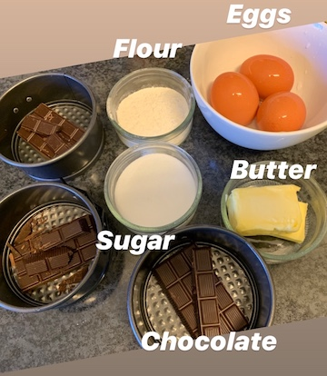
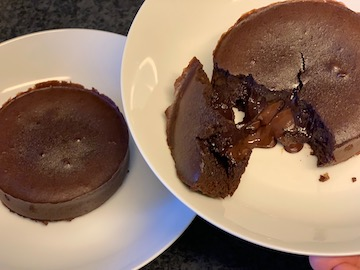
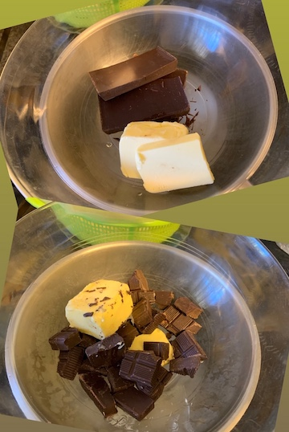
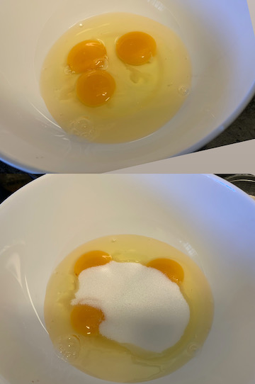
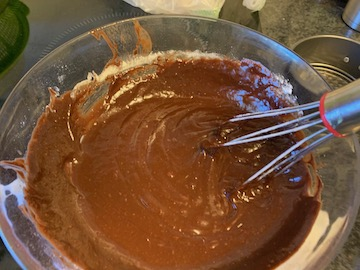

# Fondant au Chocolat

Recipe for 4 person

## Ingredients

* 150g dark chocolate (70% cocoa)
* 50g butter
* 3 eggs
* 70g brown cane sugar
* 33g flour
* 0.5 pinch of salt

## Processing

0. Pre heat the oven at 180°C (for about 10min).

1. Melt butter with chocolate (ie: bain-marie).
2. Mix eggs with sugar (gently).
3. Add (1. with 2.) melt chocolate with egg mixture start the mixing. 
4. Add Flour & salt then keep mixing until everything are combined.
5. Pour into your 4 baking pan (bake for 15mins).

## Tips

- The amount of sugar can be balanced according to the percent of dark chocolate.
- Once the mixture is poured in baking pan, add piece of raw chocolate in middle ;).
- (4x 5cm ~ 2inch) pans bake for 15mins.
- (2x 10cm ~ 4inch) springform pan bake for 20 mins.

## FAQ

- Good quality pan doesn't required to spread butter on it.

## Steps Illustrations

1. Melt butter with chocolate

2. Mix eggs with sugar

3. Melt chocolate with egg mixture start the mixing. 
4. Add Flour & salt then keep mixing until everything are combined.

5. Pour into your 4 baking pan 

